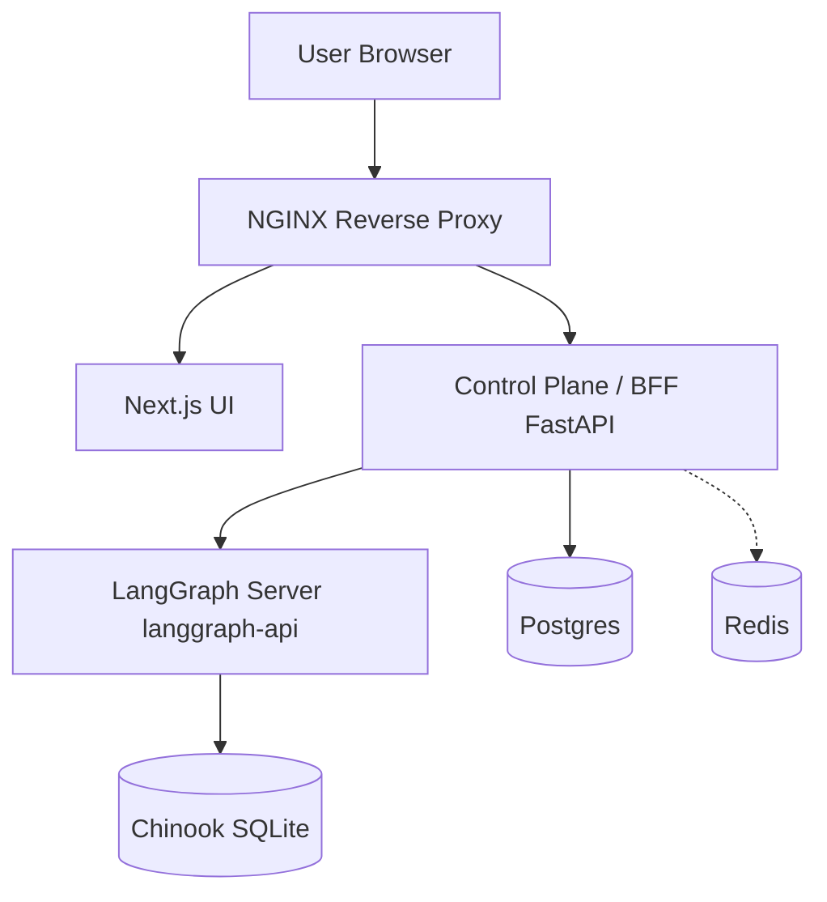
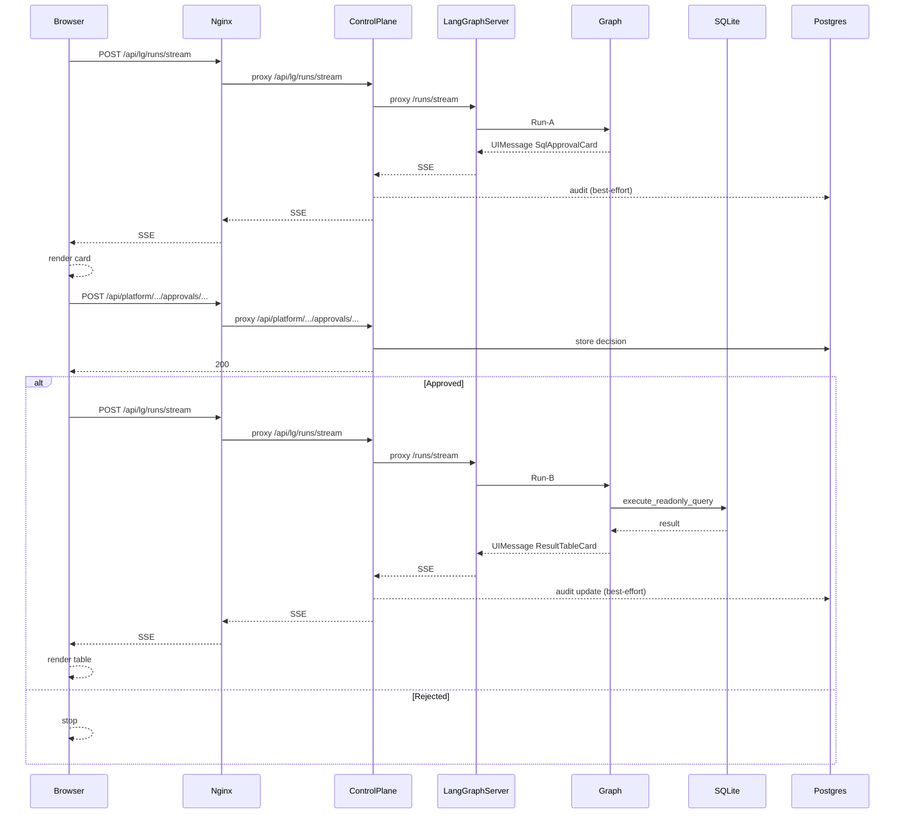

# 当前架构（以仓库实现为准）

> 目标：把“现在代码跑起来时，谁在什么层做什么事”画清楚，便于你审查并决定是否要把方向切到研究阶段。

## 一句话版本

这套系统在 **LangGraph Server（langgraph-api）** 之上额外加了一层 **Control Plane/BFF（FastAPI）**：对外统一挂载 `/api/platform/*`、`/api/lg/*`、`/api/agui/*`，并由 Nginx 作为唯一公网入口反代到 UI 与 Control Plane。

---

## 组件/服务拓扑图



Renderer note (important):
- Mermaid requires the two diagrams to be in separate fenced blocks. If you paste both diagrams into one block (or remove the closing ```), renderers will report a syntax error at the point where `sequenceDiagram` appears.
- If your renderer does not support Mermaid at all, use the ASCII fallback section at the end of this doc.

### 关键文件索引

- Nginx：`infra/nginx/nginx.conf`
- Compose 拓扑：`infra/docker-compose.yml`
- Control Plane 入口：`backend/src/omo_platform/api/app.py`
- Platform API：`backend/src/omo_platform/api/platform_router.py`
- LangGraph 代理：`backend/src/omo_platform/langgraph_proxy/router.py`
- AG-UI 网关：`backend/src/omo_platform/agui_gateway/router.py`
- LangGraph 图：`backend/src/omo_platform/graphs/sql_agent.py`

---

## 对外 API 面（按路径划分）

| 路径前缀 | 归属 | 目的 | 备注 |
|---|---|---|---|
| `/` | UI | Web 前端 | Nginx 反代到 `ui:3000` |
| `/api/platform/*` | Control Plane | 平台域：connections/audit/approvals | 需要 `X-User-Id` + `X-Project-Id` |
| `/api/lg/*` | Control Plane | LangGraph Server API 的反向代理 | 透传/保持 SSE；并做 best-effort 审计写入 |
| `/api/agui/*` | Control Plane | 把 LangGraph streaming 适配成 AG-UI SSE | 现有 endpoint：`POST /api/agui/agent` |

---

## SQL 审批 + 执行（Run-A / Run-B）时序图

说明：这里的“卡片”来自 LangGraph 的 `custom events` / `UIMessage` 机制；UI 把卡片渲染在对应 AI message 下，并把审批结果回调到 platform API。



---

## ASCII 兜底图（不依赖 Mermaid 渲染器）

当你的 Markdown 渲染环境不支持 Mermaid 或语法兼容性不稳定时，用下面这张纯文本图也能审查架构：

```text
Browser
  |
  v
NGINX (infra/nginx/nginx.conf)
  |-- / ------------------------> UI (Next.js, ui/)
  |
  `-- /api/* -------------------> Control Plane / BFF (FastAPI, backend/.../api/app.py)
                                  |-- /api/platform/* --> Postgres (audit/metadata)
                                  |-- /api/lg/* --------> LangGraph Server (langgraph-api)
                                  `-- /api/agui/agent --> LangGraph Server (SSE -> AG-UI SSE)

LangGraph Server
  `-- executes graph (sql_agent) and runs SELECT-only against Chinook SQLite (infra/chinook/chinook.db)
```

---

## 关于你提出的分层描述（需要特别注意的一点）

你说的“底层 `langgraph + langgraph api`，上层 `agui + 前端`”基本捕捉到了 **LangGraph Server + 上层协议/前端** 的关系。

但就本仓库的实现而言，当前架构还明确存在并且承担关键职责的一层：

- **Control Plane/BFF（FastAPI）**：负责 `/api/platform/*`、`/api/lg/*`、`/api/agui/*` 的统一 API 面、身份注入、审计写入、以及 AG-UI 的 SSE 网关。

如果你希望把架构压扁成“LangGraph API + AG-UI + UI”，就需要决定：Control Plane 这层是要保留（平台化）、简化（只做平台域）、还是移除（把平台能力搬到别处）。

---

## 可能存在的路径冲突（作为审查点）

UI 内还有一个 Next.js 的 `/api/*` 通配代理（`ui/src/app/api/[..._path]/route.ts`），用于把 UI 的 `/api/*` 代理到真实 LangGraph 部署。

但在当前 Compose/Nginx 配置中，`/api/` 整段被 Nginx 转发到了 Control Plane，因此生产形态下更像是：

`Browser -> Nginx /api/* -> Control Plane -> LangGraph`

而不是：

`Browser -> Next.js /api/* -> LangGraph`

你审查时可以重点确认：最终希望哪条链路成为“唯一真相”的对外入口（single front door），以及如何避免 `/api/platform/*` 被误转发到 LangGraph。
